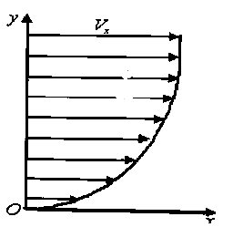
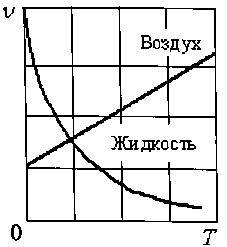
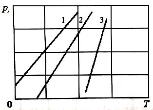
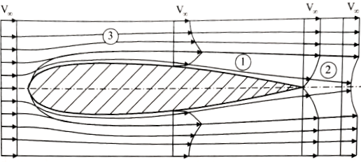
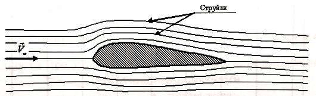
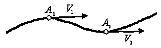
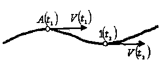
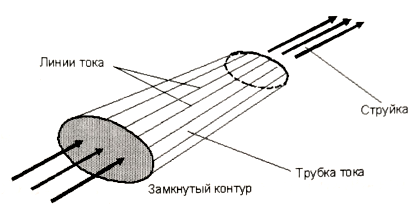
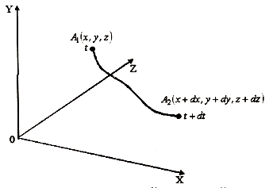

# Раздел 1. ТЕОРЕТИЧЕСКАЯ ГИДРОМЕХАНИКА
## Глава 1. КИНЕМАТИКА ЖИДКОСТЕЙ И ГАЗОВ
### 1.1. Основные физические свойства жидкостей и газов: плотность, сжимаемость, вязкость, испаряемость
В аэромеханике, под жидкостью и газом понимается среда, законы которой, а также силы взаимодействия её с обтекаемым телом являются предметом познания и научного исследования. Жидкость как физическая среда в отличие от газа обладает двумя отличительными свойствами:

- не изменяет объём при изменении давления и температуры;
- обладает текучестью и принимает форму сосуда или русла (в малых количествах - сферы).

К основным физическим свойствам и характеристикам жидкостей и газов относят плотность, сжимаемость, вязкость и испаряемость.
*Плотность*. Плотностью называется масса жидкости, заключенная в единице объёма:
$$
\rho = \frac { m } { W } , \frac { \textit{кг} } { \textit{м} ^ { 3 } },\tag{1.1}
$$
где ${ m }$ - масса жидкости;  ${ W }$ - объём жидкости.
*Сжимаемость*. Сжимаемостью называется свойство среды изменять свою плотность при изменении давления. Из физики известно, что сжимаемость - это, которое численно равно (скорости звука):
$$
\frac { \partial p } { \partial \rho } = a ^ { 2 },\tag{1.2}
$$
отношение изменения давления к изменению плотности квадрату скорости распространения слабых возмущений где  ${ p }$ - давление;  ${ a }$ - скорость распространения слабых возмущений (скорость звука). При изучении основных законов динамики жидкостей и газов. будет показано, что в движущихся жидкостях и газах согласно закону сохранения энергии давление ${ p }$ связано с изменением скорости ${ V }$, а ${ V }$ в соответствии с законом сохранения массы зависит от массовой плотности ${ \rho }$.
Таким образом, сжимаемость зависит как от физических свойств среды (скорости звука), так и от скорости её движения.
Отсюда следует, что для соблюдения подобия по сжимаемости двух различных потоков необходимо, чтобы были одинаковыми отношения скоростей течения (полёта) к скоростям звука в данных средах. Это соотношение называется числом Маха (по имени австрийского учёного Э. Маха) и обозначается буквой ${ M _ { \infty } }$:
$$
M _ { \infty } = \frac { V _ { \infty } } { a _ { \infty } }.\tag{1.3}
$$
В аэродинамике, где широко применяется физическое моделирование течений в аэродинамических трубах, число ${ M _ { \infty } }$ является важнейшим критерием, характеризующим подобие потоков по проявлению сжимаемости и воздействием на обтекаемое тело в лабораторных и натурных условиях.
По числу ${ M _ { \infty } }$ скорость потока (скорость полёта) может быть, дозвуковой ${\left( M _ { \infty } < 1 \right)}$, звуковой ${\left( M _ { \infty } = 1 \right)}$ и сверхзвуковой	Большие сверхзвуковые скорости ${\left( M _ { \infty } >> 1 \right)}$, при которых начинается изменение физико-химических свойств газа, называются гиперзвуковыми.
В теоретических исследованиях, когда ${ M _ { \infty } << 1}$, сжимаемость проявляется слабо, ею можно пренебречь.
Для жидкостей (в отличие от газов) в качестве характеристики сжимаемости используется также коэффициент объёмного сжатия:
$$
\beta _ { p } = - \frac { 1 } { W _ { 0 } } \frac { \Delta W } { \Delta p } , \frac { \textit{м} ^ { 2 } } { H },\tag{1.4}
$$
где $\Delta W = W - W _ { 0 }$ изменение объёма; $\Delta p= p - p _ { 0 }$ - изменение давления, ${W_{0}}$ и $p_{0}$ - объём и давление, соответствующие начальным условиям. Знак (-) перед формулой (1.4) показывает, что положительному изменению $p$ соответствует отрицательное изменение $W$ .	
Иногда используют величину, обратную коэффициенту объёмного сжатия, которую обозначают $K$  и называют объёмным модулем упругости:
$$
K = \frac { 1 } { \beta _ { 0 } } = - \frac { \Delta p } { \Delta W } W _ { 0 } , \frac { H } { \textit{м} ^ { 2 } }.\tag{1.5}
$$
Например, для воды при нормальных условиях: $K = 2 \cdot 10 ^ { 9 } \frac { H } { \textit{м} ^ { 2 } }$. (т.е при возрастании $p$ на $\textit{1 Па}$  объём воды $W$ уменьшится на $0,5 \cdot 10 ^ { - 9 }$ часть).
*Вязкость*. Вязкостью называется способность жидкости или газа сопротивляться сдвигу слоёв друг относительно друга. Вследствие вязкости на теле образуется пограничный слой,в котором скорость $V_{x}$ уменьшается по нормали к поверхности до нуля (рис. 1.1). $V_{x}$ - составляющая скорости вдоль оси $Ox$.
Вязкость обуславливает внутреннее трение в жидкости или газе, а также силу сопротивления трения движущихся в них тел. Вязкость характеризуется касательными напряжениями трения $\tau$. Для ламинарного пограничного слоя в соответствии с гипотезой Ньютона:
$$
\tau = \mu \frac { d V _ { x } } { d y } , \frac { H } { \textit{м} ^ { 2 } },\tag{1.6}
$$
где $\mu$ - коэффициент динамической вязкости, $\frac {\textit{ Hс }} { \textit{м} ^ { 2 } }$.

Рис. 1.1. Профиль скоростей в пограничном слое

Уменьшение вязкости и увеличение скорости на профиль скоростей качественно влияют одинаково. Критерием, характеризующим соотношение сил вязкости по отношению к силам инерции, является число Рейнольдса (по имени английского ученого О. Рейнольдса), которое обозначается $R e _ { \infty }$:
$$
R e _ { \infty } = \frac { V _ { \infty } l } { \nu },\tag{1.7}
$$
где $V_ { \infty }$ - скорость потока; $l$ - длина тела; ${\nu }$ - коэффициент кинематической вязкости:
$$
{\nu } = \frac { \mu } { \rho } , \frac { \textit{м} ^ { 2 } } { c }.\tag{1.8}
$$
Здесь ${ \rho }$ - плотность среды. Таким образом, вязкость газа или жидкости по отношению к обтекаемому телу есть понятие относительное, зависящее от величины числа $R e$. При малых числах $R e$ значение вязкости в формировании аэродинамических сил велика, и, наоборот, с ростом $R e$ её значимость уменьшается, среда для обтекаемого тела становится как бы менее вязкой. 

Рис. 1.2. Зависимость вязкости жидкости и газа от температуры

Вязкость жидкостей и газов сильно зависит от температуры $T$ (рис. 1.2). С увеличением $T$  в жидкости уменьшаются силы межмолекулярного сцепления, и $\nu$ уменьшается. В газах с увеличением $T$  эти силы, наоборот, увеличиваются в результате теплового движения и, как следствие, ${\nu }$ увеличивается.
Вязкость также зависит и от давления. С увеличением ${ \rho }$ вязкость жидкости увеличивается. Это важно для авиационных систем, где в результате изменения давления, например с подъёмом на высоту, вязкость может заметно изменятся.
*Испаряемость*. Испаряемостью называется способность жидкости переходить из жидкого состояния в газообразное.
Характеристикой испаряемости является температура кипения при нормальных условиях: чем выше температура кипения, тем меньше испаряемость. С подъёмом на высоту температура кипения уменьшается.
Более полной характеристикой испаряемости является давление насыщенных паров $p_{t}$ в зависимости от температуры $T$: чем больше $p_{t}$ , тем больше испаряемость жидкости. С увеличением температуры $T$ , $p_{t}$ увеличивается (рис. 1.3). Здесь номерами $1$ , $2$ и $3$ показаны различные жидкости. С возрастанием порядкового номера вязкость жидкости уменьшается.

Рис. 1.3. Зависимость давления насыщенных паров от температуры	

Давление насыщенных паров $p_{t}$ — важная характеристика для жидкостных авиационных систем на предмет годности их эксплуатации в условиях высоких $T$ и низких $p$, что актуально для топливных и гидравлических систем самолётов.

### 1.2. Гипотеза сплошности. Число Кнудсена
Жидкости и газы имеют молекулярное строение. Для исследования взаимодействия жидкостей или газов с обтекаемыми телами необходимо изучить движение отдельных молекул, используя кинетическую теорию и методы статистической физики. В аэрогидродинамике во многих случаях молекулярным строением жидкостей или газов можно пренебречь и рассматривать жидкости или газы как сплошную среду.
Обоснованием этого положения является тот факт, что в $1 \textit {мм} ^ { 3 }$воздуха при нормальных условиях содержится $2,7 \cdot 10 ^ { 16 }$ молекул, а межмолекулярные расстояния настолько малы по сравнению с обтекаемым телом, что ими можно пренебречь. Средняя длина свободного пробега молекул $l _ { 0 } = 6,3 \cdot 10 ^ { - 5 } \textit{мм}$.
Однако с увеличением высоты количество молекул в единице объёма воздуха падает, поэтому, на высотах порядка $80 ... 100 \textit{км}$приходится учитывать дискретную структуру газа. Критерием сплошности среды служит число Кнудсена (по имени датского учёного М. X. К. Кнудсена), которое обозначается $Kn$:
$$
Kn = \frac { l _ { 0 } } { L },\tag{1.9}
$$
где $l_{0}$ - длина свободного пробега молекул; $L$ - длина тела.
Течение принято считать сплошным, если $Kn < 10 ^ { - 3 }$. Если же $Kn > 10$, то течение называется свободномолекулярным, и тогда необходимо учитывать молекулярную структуру газа. При $10 \geq Kn \geq 10 ^ { - 3 }$ течение называется течением со скольжением.
Для расчёта аэродинамики самолётов и других летательных аппаратов, летающих на относительно небольших высотах, в большинстве случаев используется гипотеза сплошности.

### 1.3. Общая картина обтекания тела потоком жидкости или газа. Турбулентность

Рассмотрим обтекание газом или жидкостью какого-либо тела со скоростью. Весь поток можно условно разделить на три области (рис. 1.4): область $1$ -тонкий слой, называемый пограничным слоем, где сильно проявляются силы вязкости, имеются большие градиенты скорости. Здесь необходимо учитывать силы трения. Область $2$ — след (спутный след) за телом.
Здесь наблюдаются большие градиенты скоростей, силы вязкости могут иметь также большие значения. Кроме того, спутный след характеризуется нерегулярными взаимными перемещениями объёмов среды и их перемешиванием и сопровождается хаотичными изменениями параметров. Это явление носит название турбулентности. Область $3$ — поток вне пограничного слоя и следа, где силы вязкости несущественные и градиенты скорости весьма малы.
Касательные напряжения трения также малы. Здесь газ считают идеальным Исследование приведённой картины обтекания тела газом позволяет решение общей задачи аэродинамики (о движении газа и об определении сил, действующх на тело) разделить на ряд отдельных независимых задачю.

Рис. 1.4. Общая картина обтекания тела потоком жидкости или газа.

Например, при исследовании силового воздействия потока на тело от сил давления можно считать, что пограничный слой отсутствует (так как он весьма тонкий), а газ является идеальным.
Расчёт пограничного слоя обычно сводится к определению касательных сил трения и тепловых потоков, вызванных торможением газа в пограничном слое. Расчёт воздействия спутной струи на тела, попадающие в нее, проводится отдельно.

### 1.4. Принцип обратимости. Модели среды: модель Ньютона, модель Эйлера, модель Прандтля
Аэродинамика при изучении силового взаимодействия жидкостей или газов с телом опирается на важный постулат, называемый принципом обратимости. Согласно этому принципу картина обтекания тела и силы, действующие на него, будут одинаковыми, независимо от того, движется ли тело в неподвижной среде или на неподвижное тело набегает поток.
Принцип обратимости значительно облегчает физическое и математическое моделирование обтекания тел при рассмотрении их неподвижными, а воздушную струю - движущейся. Физическое моделирование позволят исследовать силовое воздействие потока на обтекаемые тела в аэродинамических трубах, а математическое моделирование, в свою очередь, даёт возможность проводить исследования на базе фундаментальных законов механики газовой динамики с применением аппарата высшей математики.
Для изучения взаимодействия тела с потоком жидкости или газа существуют модели среды.

*1. Модель Ньютона.* Первая модель обтекания тела потоком жидкости или газа была предложена И. Ньютоном. Согласно его теории поток жидкостей или газов представляется в виде отдельных корпускул, не взаимодействующих друг с угом При встрече с телом корпускулы взаимодействуют с ним по закону абсолютно неупругого удара и передают телу по нормали к поверхности импульс силы (рис 1.5). Таким образом, импульс силы возникает как результат изменения количества движения частиц (корпускул).

Рис. 1.5. Модель Ньютона

Такая модель достаточно проста, но даёт завышенные результаты из-за аэродинамической тени, где давление на теле равно нулю. С помощью модели Ньютона могут быть получены хорошие результаты при исследовании разряжённых газов.

*2.	Модель Эйлера.* Эта модель среды предложена Л. Эйлером именована на гипотезе сплошности. В ней предполагается рассматривать газы или жидкости в виде сплошной среды с непрерывно распределённой по объёму массой (рис. 1.6.)

Рис. 1.6. Модель Эйлера

При этом среда - идеальная жидкость (несжимаемая жидкость, лишённая сил вязкости называется идеальной), разбита на множество струек, взаимодействующих с телом. Такая модель позволяет достаточно хорошо описывать течение вокруг тела, за исключением пограничного слоя и следа, где сильно сказываются силы вязкости, и модель Эйлера даёт погрешность.
*3.	Модель Прандтля.* Математическая модель среды, предложенная Л. Прандтлем, основана на гипотезе сплошности.
В ней предлагается разделить весь поток на две области:
* внешний поток (жидкость или газ считаются идеальными), где можно не учитывать силы вязкости;
* пограничный слой - силы вязкости необходимо учитывать.

По сравнению с моделями среды И. Ньютона и Л. Эйлера модель Л. Прандтля является наиболее точной. Она широко используется при расчёте течения вокруг тела с отрывом потока с его поверхности.

### 1.5. Виды изучаемых течений
В аэродинамике различают следующие виды течений:

- установившееся;
- неустановившееся.

Течение называется ***установившимся***, если в произвольной точке пространства его параметры (массовая плотность, давление, скорость, температура) с течением времени не изменяются. Течение называется ***неустановившимся***, если в произвольной точке пространства его параметры изменяются с течением времени.
Установившееся и неустановившееся течения могут быть:

- потенциальным (безвихревым);
- вихревым.

***Потенциальным*** называется течение, если в произвольной точке пространства А выполняется условие:
$$
r o t V _ { A } = 0.\tag{1.10}
$$
***Вихревым*** называется течение, если в произвольной точке пространства $A$ справедливо неравенство:
$$
r o t V _ { A } \neq 0.\tag{1.11}
$$
Другими словами, если частицы жидкости или газа при своём движении не вращаются, то такое течение называется потенциальным. И наоборот, если частицы жидкости или газа при своём движении вращаются, то такое течение называется вихревым.

### 1.6. Линии тока и струйки. Скорости и ускорения
Для наглядности представления течения в аэрогидродинамике пользуются следующими понятиями:

- линия тока;
- траектория;
- трубка тока;
- струйка.

*Линия тока* - линия, в каждой точке которой в данный момент времени скорости направлены по касательной к ней (рис. 1.7, его можно рассматривать как мгновенную фотографию течения).

Рис. 1.7. Линия тока

*Траектория* — геометрическое место точек, соответствующих последовательным положениям движущейся частицы (рис. 1.8). В общем случае неустановившегося течения линии тока с траекториями не совпадают. Если движение установившееся, то траектории совпадают с линиями тока.

Рис. 1.8. Траектория

*Трубка тока* - поверхность, образованная замкнутым контуром, проведённым через линии тока (рис. 1.9).
*Струйка* - жидкость или газ, движущиеся внутри трубки тока.
Получим математические выражения для скоростей и ускорений Выделим в движущемся потоке жидкости или газа элементарную частицу, которая в момент времени t находится в точке $A _ { 1 } ( x , y , z )$, а в момент $t + dt$ - в точке $A _ { 2 } ( x + d x , y + d y , z + d z )$ (рис. 1.10).

Рис. 1.9. Трубка тока и струйка

Пусть за время $dt$ частица переместилась из точки $A_{1}$ в точку $A_{2}$ на расстояния $dx,dy,dz$, тогда
$$
V _ { x } = \frac { d x } { d t } , V _ { y } = \frac { d y } { d t } , V _ { z } = \frac { d z } { d t }.\tag{1.12}
$$

Рис. 1.10. К выводу уравнений скоростей и ускорений

Теперь получим формулы для ускорений. По определению, ускорение - это:
$$
\frac { d V _ { x } } { d t } , \frac { d V _ { y } } { d t } , \frac { d V _ { z } } { d t }.\tag{1.13}
$$
Разделим на ${dt}$ и окончательно получим
$$
\frac { d V _ { ( x , y , z ) } } { d t } = \frac { \partial V _ { ( x , y , z ) } } { \partial x } V _ { x } + \frac { \partial V _ { ( x , y , z ) } } { \partial y } V _ { y } + \frac { \partial V _ { ( x , y , z ) } } { \partial z } + \frac { \partial V _ { ( x , y , z ) } } { \partial t }.\tag{1.14}
$$
Аналогично находим формулы для других параметров. Например: $$
\frac { d p } { d t } = \frac { \partial p } { \partial x } V _ { x } + \frac { \partial p } { \partial y } V _ { y } + \frac { \partial p } { \partial z } V _ { z } + \frac { \partial p } { \partial t }.\tag{1.15}
$$
или
$$
\frac { d \rho } { d t } = \frac { \partial \rho } { \partial x } V _ { x } + \frac { \partial \rho } { \partial y } V _ { y } + \frac { \partial \rho } { \partial z } V _ { z } + \frac { \partial \rho } { \partial t }.\tag{1.16}
$$
В случае установившегося движения, когда параметры потока в рассматриваемых точках с течением времени не меняются, формулы $( 1.14 \dots 1 .16 )$ упрощаются, так как
$$
\frac { \partial V _ { x } } { \partial t } = \frac { \partial V _ { y } } { \partial t } = \frac { \partial V _ { z } } { \partial t } = \frac { \partial p } { \partial t } = \frac { \partial \rho } { \partial t } = 0. \tag{1.17}
$$